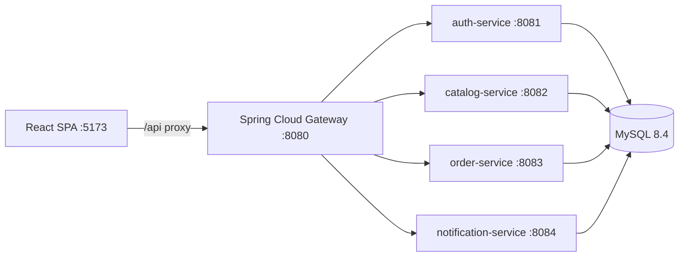

# PixelMart

PixelMart is a portfolio-grade e-commerce platform built as a Spring Boot microservices monorepo with a React storefront and MySQL persistence. The project is intentionally small enough to run locally with Docker Compose, while still modeling production concerns such as an API gateway, service-owned schemas, Flyway migrations, JWT authentication, refresh token rotation, role-based admin APIs, local media storage, checkout price snapshots, offer-driven pricing, reviews, wishlist, audit logging, and CI.

## One-command local start

```bash
cp .env.example .env   # Windows: Copy-Item .env.example .env
docker compose up --build
```

In a second terminal:

```bash
cd frontend && npm install && npm run dev
```

Open `http://localhost:5173`. The SPA proxies `/api` to the gateway at `http://localhost:8080`.

## Current status — v1 complete

| Week | Focus | Status |
|------|-------|--------|
| 1 | Foundation, auth, catalog, branding, product browse | Complete |
| 2 | Cart, addresses, checkout, offers, order history | Complete |
| 3 | Wishlist, reviews, admin console, audit log, CI, polish | Complete |

Demo seed data (Flyway `V8__demo_seed.sql`) includes **15 visible products**, **2 active offers**, and **sample reviews** (approved on the storefront plus one pending item for admin moderation).

## Screenshots

| Storefront home | Admin dashboard |
|-----------------|-----------------|
|  |  |

Replace the SVG mockups with PNG captures from your local run when preparing a portfolio submission.

## 3-minute demo script

1. **Start stack (30s)** — Run `docker compose up --build`, then `cd frontend && npm run dev`. Confirm `http://localhost:8080/actuator/health` is UP.
2. **Storefront (45s)** — Open home, note the deals banner and offer badges. Browse `/products`, open a product detail page, read seeded reviews, toggle wishlist (customer login required).
3. **Customer checkout (60s)** — Sign in as `customer@pixelmart.local` / `Customer@123`, add a fashion item to cart, go to checkout, enter coupon `STYLE15`, choose mock card, place order, open order detail.
4. **Admin console (45s)** — Sign in as `admin@pixelmart.local` / `Admin@123`, open `/admin` dashboard, toggle product visibility, approve the pending review, browse audit log filters, tweak primary color in settings and confirm the storefront theme updates.

## Feature overview

- **Storefront:** themed React app, dynamic store branding, product listing/detail pages, image gallery, featured products, active deals banner, cart badge, cart page, checkout stepper, coupon field, wishlist, reviews, and order success/detail page.
- **Authentication:** email/password registration, login, JWT access tokens, HTTP-only refresh token cookie, silent refresh, logout, `/me`, profile update, and admin/customer roles.
- **Catalog:** categories, products, public reads, admin CRUD, visibility filtering, local product image uploads, store settings, active offers, coupon-aware effective pricing, wishlist, moderated reviews, and audit log entries for admin changes.
- **Orders:** one cart per user, add/update/remove cart items, address CRUD, India pincode proxy/cache, mock payment methods, checkout stock validation, order/item/payment snapshots, and cart clearing on success.
- **Platform:** Spring Cloud Gateway on `:8080`, service-owned MySQL schemas, Flyway migrations, Docker Compose for the backend stack, GitHub Actions CI, and Vite dev server for the frontend.

## Architecture

The React SPA talks to `/api`, which is proxied to Spring Cloud Gateway. The gateway routes requests to domain services and validates JWTs for protected paths. All services share one MySQL instance but write to separate schemas.



| Service | Port | Schema | Responsibility |
|---------|------|--------|----------------|
| `gateway` | `8080` | N/A | API routing, JWT validation, user/role forwarding |
| `auth-service` | `8081` | `auth` | Users, roles, access/refresh token lifecycle |
| `catalog-service` | `8082` | `catalog` | Products, categories, images, settings, offers, reviews, wishlist, audit log |
| `order-service` | `8083` | `orders` | Carts, addresses, pincode cache, checkout, orders, payments |
| `notification-service` | `8084` | `notify` | Email outbox / order confirmation |
| `frontend` | `5173` | N/A | React storefront and admin console |

See [docs/architecture.md](docs/architecture.md) for more detail.

## Tech stack

- **Backend:** Java 21, Spring Boot 3.4.2, Spring Cloud 2024.0, Spring Security, Spring Data JPA, Flyway, MySQL 8.4, springdoc OpenAPI.
- **Frontend:** React 19, Vite 6, TypeScript, Redux Toolkit, RTK Query, React Router 7, MUI 9 (admin), React Hook Form, Zod.
- **Local runtime:** Docker Compose for MySQL, gateway, and backend services; Vite dev server for the frontend.

## Quick start

### 1. Clone and configure

```bash
git clone <repo-url>
cd pixelmart
cp .env.example .env
```

### 2. Start backend stack

```bash
docker compose up --build
```

Useful backend URLs:

| URL | Description |
|-----|-------------|
| `http://localhost:8080/actuator/health` | Gateway health |
| `http://localhost:8080/api/auth/health` | Auth service through gateway |
| `http://localhost:8080/api/catalog/health` | Catalog service through gateway |

### 3. Start frontend

```bash
cd frontend
npm install
npm run dev
```

### 4. Seeded accounts

| Role | Email | Password |
|------|-------|----------|
| Admin | `admin@pixelmart.local` | `Admin@123` |
| Customer | `customer@pixelmart.local` | `Customer@123` |

Active demo coupon: `STYLE15` (fashion category, 15% off).

## OpenAPI / Swagger UI

OpenAPI is generated per service on its **direct port** (not through the gateway):

| Service | Swagger UI | OpenAPI JSON |
|---------|------------|--------------|
| auth-service | http://localhost:8081/swagger-ui/index.html | http://localhost:8081/v3/api-docs |
| catalog-service | http://localhost:8082/swagger-ui/index.html | http://localhost:8082/v3/api-docs |
| order-service | http://localhost:8083/swagger-ui/index.html | http://localhost:8083/v3/api-docs |
| notification-service | http://localhost:8084/swagger-ui/index.html | http://localhost:8084/v3/api-docs |

## Storage profiles

| Profile | Config | Notes |
|---------|--------|-------|
| **Local (default)** | `STORAGE_TYPE=local`, `STORAGE_LOCAL_PATH=./data/uploads` | Product images and logos stored on disk; Docker Compose mounts a `catalog_uploads` volume. |
| **S3 (placeholder)** | `STORAGE_TYPE=s3` | Adapter stub in `S3StorageService`; returns a clear error until AWS SDK wiring is added. Set `AWS_REGION`, `AWS_S3_BUCKET`, and credentials in `.env` when implementing production media. |

## Validation commands

```bash
mvn verify
cd frontend && npm run build
```

CI runs the same checks on push/PR via `.github/workflows/ci.yml`.

Reset local database and uploads:

```bash
docker compose down -v
docker compose up --build
```

## API route map

| Prefix | Routed to |
|--------|-----------|
| `/api/auth/**` | auth-service |
| `/api/catalog/**` | catalog-service |
| `/api/admin/**` | catalog-service or order-service (see gateway routes) |
| `/api/orders/**` | order-service |
| `/api/internal/**` | notification-service |

## Environment variables

| Variable | Purpose |
|----------|---------|
| `MYSQL_*` | Database credentials for compose |
| `JWT_SECRET` | Shared auth/gateway JWT signing secret |
| `JWT_ACCESS_EXPIRATION_MS` / `JWT_REFRESH_EXPIRATION_MS` | Token lifetimes |
| `STORAGE_TYPE` | `local` (default) or `s3` placeholder |
| `STORAGE_LOCAL_PATH` | Local upload directory |
| `AWS_REGION`, `AWS_S3_BUCKET`, `AWS_ACCESS_KEY_ID`, `AWS_SECRET_ACCESS_KEY` | Future S3 media profile |
| `MAIL_*` | Notification-service SMTP settings |

## Troubleshooting

- **`JAVA_HOME` invalid:** point at JDK 21, then rerun Maven.
- **Port already allocated:** stop services on `3306`, `8080`–`8084`, or `5173`.
- **Frontend API failures:** confirm compose is running and gateway health responds.
- **Images missing after reset:** `docker compose down -v` deletes the upload volume.

## Documentation

- [Master specification](docs/PIXELMART_MASTER_SPEC.md)
- [Daily targets](docs/DAILY_TARGETS.md)
- [Architecture](docs/architecture.md)

## License

See [LICENSE](LICENSE).
