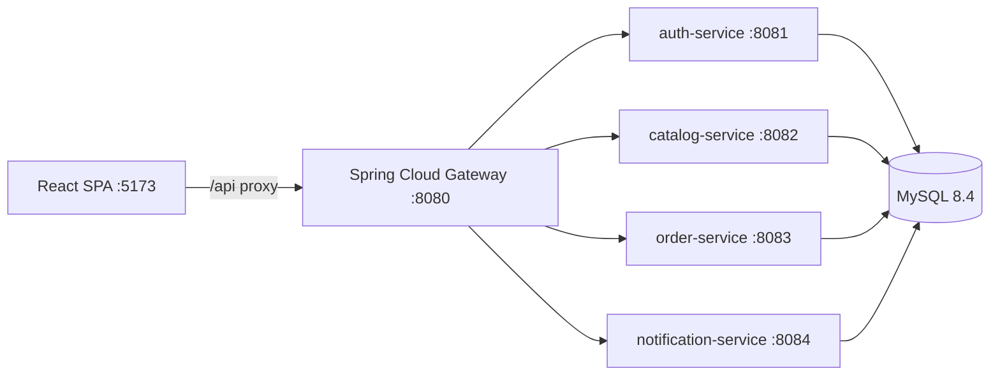

# PixelMart

PixelMart is a portfolio-grade e-commerce platform built as a Spring Boot microservices monorepo with a React storefront and MySQL persistence. The project is intentionally small enough to run locally with Docker Compose, while still modeling production concerns such as an API gateway, service-owned schemas, Flyway migrations, JWT authentication, refresh token rotation, role-based admin APIs, local media storage, checkout price snapshots, and offer-driven pricing.

## Current Status

PixelMart is being built from the day-by-day plan in `docs/DAILY_TARGETS.md`.

| Week | Focus | Progress |
|------|-------|----------|
| 1 | Foundation, auth, catalog, branding, product browse | Complete |
| 2 | Cart, addresses, checkout, seasonal offers, order history | Day 9 complete, Day 10 next |
| 3 | Wishlist, reviews, admin dashboards, audit UI, tests, CI, polish | Not started |

Completed user paths include registration/login, refresh/logout, public catalog browse, product images, admin store settings, cart, address CRUD with pincode lookup, mock checkout, order detail, and seasonal offer pricing. The next planned work is Day 10: notification outbox plus order history/admin order screens.

## Feature Overview

- Storefront: themed React app, dynamic store branding, product listing/detail pages, image gallery, featured products, active deals banner, cart badge, cart page, checkout stepper, coupon field, and order success/detail page.
- Authentication: email/password registration, login, JWT access tokens, HTTP-only refresh token cookie, silent refresh, logout, `/me`, profile update, and admin/customer roles.
- Catalog: categories, products, public reads, admin CRUD foundation, visibility filtering, local product image uploads, store settings, active/expired offers, product/category discounts, coupon-aware effective pricing, and audit log entries for admin changes.
- Orders: one cart per user, add/update/remove cart items, address CRUD, India pincode proxy/cache, mock payment methods, checkout stock validation, order/item/payment snapshots, and cart clearing on success.
- Platform: Spring Cloud Gateway on `:8080`, service-owned MySQL schemas, Flyway migrations, Docker Compose for the backend stack, Vite dev server for the frontend.

## Architecture

The React SPA talks to `/api`, which is proxied to Spring Cloud Gateway. The gateway routes requests to domain services and validates JWTs for protected paths. All services share one MySQL instance but write to separate schemas.



| Service | Port | Schema | Responsibility |
|---------|------|--------|----------------|
| `gateway` | `8080` | N/A | API routing, JWT validation, user/role forwarding |
| `auth-service` | `8081` | `auth` | Users, roles, access/refresh token lifecycle |
| `catalog-service` | `8082` | `catalog` | Products, categories, images, settings, offers, audit log |
| `order-service` | `8083` | `orders` | Carts, addresses, pincode cache, checkout, orders, payments |
| `notification-service` | `8084` | `notify` | Notification/outbox foundation |
| `frontend` | `5173` | N/A | React storefront and admin pages |

## Tech Stack

- Backend: Java 21, Spring Boot 3.4.2, Spring Cloud 2024.0, Spring Security, Spring Data JPA, Flyway, MySQL 8.4.
- Frontend: React 19, Vite 6, TypeScript, Redux Toolkit, RTK Query, React Router 7, React Hook Form, Zod.
- Local runtime: Docker Compose for MySQL, gateway, and backend services; Vite dev server for the frontend.

## Setup Plan

Use this plan for a clean local setup or when onboarding a new machine.

1. Install prerequisites: Docker Desktop, Node.js 20+, Java 21, and Maven 3.9+ if you want local backend builds outside Docker.
2. Create local environment values from `.env.example`.
3. Start the backend stack with Docker Compose and wait for MySQL plus all services to become healthy/routable.
4. Install frontend dependencies and run the Vite dev server.
5. Verify gateway health, login with seeded users, browse products, add to cart, and complete a mock checkout.
6. For development, run focused Maven module builds and `npm run build` before committing.

## Quick Start

### 1. Clone And Configure

```bash
git clone <repo-url>
cd pixelmart
cp .env.example .env
```

On Windows PowerShell, use:

```powershell
Copy-Item .env.example .env
```

The checked-in `.env.example` is safe for local development only. Change `JWT_SECRET`, database credentials, and SMTP settings before any production-like deployment.

### 2. Start Backend Stack

```bash
docker compose up --build
```

This starts MySQL, the four backend services, and the API gateway. Keep this terminal running while using the app.

Useful backend URLs:

| URL | Description |
|-----|-------------|
| `http://localhost:8080/actuator/health` | Gateway health |
| `http://localhost:8080/api/auth/health` | Auth service through gateway |
| `http://localhost:8080/api/catalog/health` | Catalog service through gateway |
| `http://localhost:8081/actuator/health` | Auth service direct health |
| `http://localhost:8082/actuator/health` | Catalog service direct health |
| `http://localhost:8083/actuator/health` | Order service direct health |
| `http://localhost:8084/actuator/health` | Notification service direct health |

### 3. Start Frontend

In a second terminal:

```bash
cd frontend
npm install
npm run dev
```

Open `http://localhost:5173`. Vite proxies `/api` to the gateway at `http://localhost:8080`.

### 4. Seeded Accounts

Flyway seeds two local users:

| Role | Email | Password |
|------|-------|----------|
| Admin | `admin@pixelmart.local` | `Admin@123` |
| Customer | `customer@pixelmart.local` | `Customer@123` |

Use the admin account for `/admin`, store settings, product image uploads, and offer management. Use the customer account for cart, address, and checkout flows.

## Validation Commands

Backend full build:

```bash
mvn clean package
```

Focused backend build for catalog and orders:

```bash
mvn -pl services/catalog-service,services/order-service -am test
```

Frontend production build:

```bash
cd frontend
npm run build
```

Frontend lint:

```bash
cd frontend
npm run lint
```

If Maven reports an invalid `JAVA_HOME`, point it at an installed JDK 21 directory. For example, in PowerShell:

```powershell
$env:JAVA_HOME = "C:\Program Files\Java\jdk-21.0.11"
mvn -v
```

## Common Development Workflow

1. Start the backend stack: `docker compose up --build`.
2. Start the frontend: `cd frontend && npm run dev`.
3. Make service or UI changes.
4. Run the smallest useful verification command.
5. Check `docs/DAILY_TARGETS.md` and update completion status only when the Definition of Done is satisfied.

For a clean database reset:

```bash
docker compose down -v
docker compose up --build
```

This deletes MySQL and upload volumes, then reruns all Flyway migrations and seed data.

## Project Structure

```text
pixelmart/
├── gateway/                       # Spring Cloud Gateway :8080
├── services/
│   ├── auth-service/              # Auth, users, roles, refresh tokens :8081
│   ├── catalog-service/           # Catalog, settings, images, offers :8082
│   ├── order-service/             # Cart, addresses, checkout, orders :8083
│   └── notification-service/      # Notification/outbox foundation :8084
├── frontend/                      # React SPA and admin UI :5173
├── docker/mysql/init/             # MySQL schema bootstrap scripts
├── docs/                          # Product spec, targets, architecture
├── docker-compose.yml             # Local backend stack
└── .env.example                   # Local environment template
```

## API Route Map

All browser-facing requests should go through the gateway on `:8080`.

| Prefix | Routed To |
|--------|-----------|
| `/api/auth/**` | `auth-service` |
| `/api/catalog/**` | `catalog-service` |
| `/api/admin/categories/**` | `catalog-service` |
| `/api/admin/products/**` | `catalog-service` |
| `/api/admin/offers/**` | `catalog-service` |
| `/api/admin/settings/**` | `catalog-service` |
| `/api/orders/**` | `order-service` |
| `/api/admin/orders/**` | `order-service` |
| `/api/internal/**` | `notification-service` |

## Environment Variables

| Variable | Purpose |
|----------|---------|
| `MYSQL_ROOT_PASSWORD` | MySQL root password for local compose |
| `MYSQL_DATABASE` | Initial database name used by the compose image |
| `MYSQL_USER` / `MYSQL_PASSWORD` | App database credentials |
| `JWT_SECRET` | Shared auth/gateway JWT signing secret |
| `JWT_ACCESS_EXPIRATION_MS` | Access token lifetime |
| `JWT_REFRESH_EXPIRATION_MS` | Refresh token lifetime |
| `STORAGE_TYPE` | Storage adapter selector, currently local |
| `STORAGE_LOCAL_PATH` | Local upload path for catalog media |
| `SMTP_HOST`, `SMTP_PORT`, `SMTP_USER`, `SMTP_PASSWORD` | Optional notification-service SMTP settings |

## Troubleshooting

- `JAVA_HOME environment variable is not defined correctly`: set `JAVA_HOME` to a real JDK 21 install and retry Maven.
- `Port already allocated`: stop other local services on `3306`, `8080`-`8084`, or `5173`, or change compose/application ports.
- Frontend API calls fail: confirm `docker compose up --build` is still running and `http://localhost:8080/actuator/health` responds.
- Login fails after schema changes: reset local volumes with `docker compose down -v`, then rebuild.
- Product images disappear after reset: uploaded media is stored in the `catalog_uploads` Docker volume, which is deleted by `down -v`.

## Documentation

- [Master specification](docs/PIXELMART_MASTER_SPEC.md)
- [Daily targets](docs/DAILY_TARGETS.md)
- [Architecture](docs/architecture.md)

## License

See [LICENSE](LICENSE).
