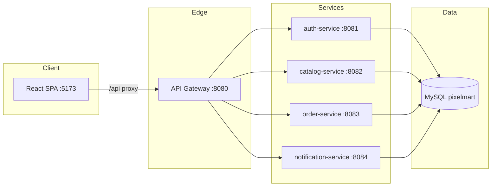

# PixelMart Architecture

## Overview

PixelMart is a minimal microservices e-commerce platform in a **monorepo**, fronted by **Spring Cloud Gateway**, backed by **one MySQL 8.4** instance with **separate schemas per service**.



## Schemas

| Schema | Service | Responsibility |
|--------|---------|----------------|
| `auth` | auth-service | Users, roles, refresh tokens |
| `catalog` | catalog-service | Products, offers, reviews, wishlist, store settings |
| `orders` | order-service | Cart, addresses, orders, payments |
| `notify` | notification-service | Email outbox |

## Gateway routes

| Path prefix | Target |
|-------------|--------|
| `/api/auth/**` | auth-service |
| `/api/catalog/**`, `/api/admin/categories/**`, … | catalog-service |
| `/api/orders/**`, `/api/admin/orders/**` | order-service |
| `/api/internal/**` | notification-service |

## Local development

**Backend only (Docker):**

```bash
cp .env.example .env
docker compose up --build
```

**Frontend (dev server with API proxy):**

```bash
cd frontend && npm install && npm run dev
```

**Backend (Maven, no Docker):**

```bash
# Start MySQL first (compose or local)
mvn -pl gateway,services/auth-service,services/catalog-service,services/order-service,services/notification-service -am spring-boot:run
```

## Ports

| Component | Port |
|-----------|------|
| API Gateway | 8080 |
| auth-service | 8081 |
| catalog-service | 8082 |
| order-service | 8083 |
| notification-service | 8084 |
| MySQL | 3306 |
| React (Vite) | 5173 |

## Related docs

- [Master spec](./PIXELMART_MASTER_SPEC.md)
- [Daily targets](./DAILY_TARGETS.md)
